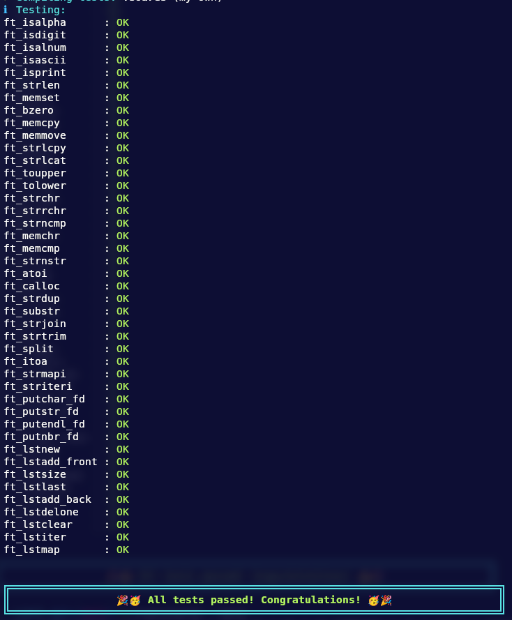

# Libft

Recreation of few functions from C standard library. This project is about understanding the way these functions work,
implementing and learning to use them.

## Tehnologies

## implemented functions

- isalpha()
- isdigit()
- isalnum()
- isascii()
- isprint()
- strlen()
- memset()
- bzero()
- memcpy()
- memmove()
- strlcpy()
- strlcat()
- toupper()
- tolower()
- strchr()
- strrchr()
- strncmp()
- memchr()
- memcmp()
- strnstr()
- atoi()
- calloc()
- strdup()

### 42_functions:
- ft_substr()
- ft_strjoin()
- ft_strtrim()
- ft_split()
- ft_itoa()
- ft_strmapi()
- ft_striteri()
- ft_putchar_fd()
- ft_putstr_fd()
- ft_putendl_fd()
- ft_putnbr_fd()

#### Bonus:
- ft_lstnew()
- ft_lstadd_front()
- ft_lstsize()
- ft_lstlast()
- ft_lstadd_back()
- ft_lstdelone()
- ft_lstclear()
- ft_lstiter()
- ft_lstmap()

## Restrictions

- Every .c files must compile with the flags -Wall -Wextra -Werror.
- Declaring global variables is forbidden.
- You must use the command ar to create your library. Using the libtool command
is forbidden.

## Tests

Test with --strict mode

